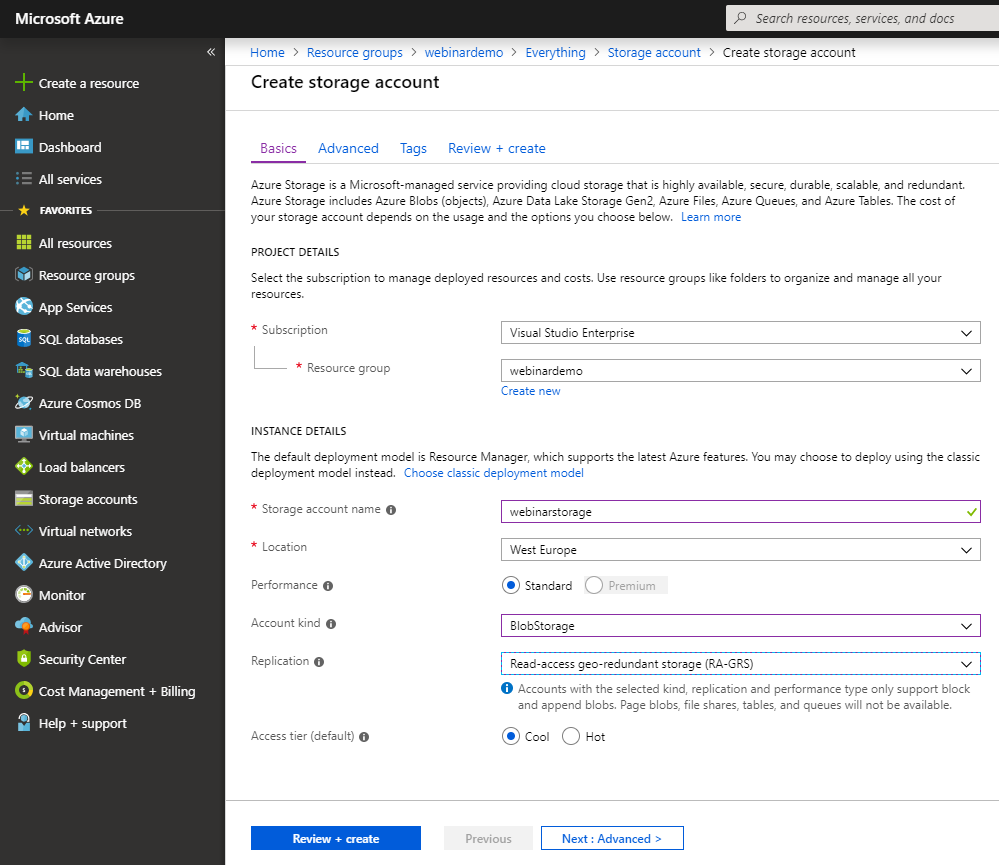
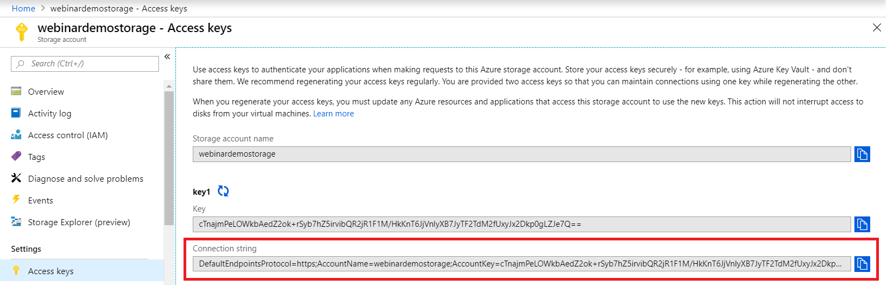

# Azure Tables

- Create a new Azure resource of the type **Storage Account** with the following settings:

The storage account name must be unique.

- The connection string can be obtained here (highlighted in red):

