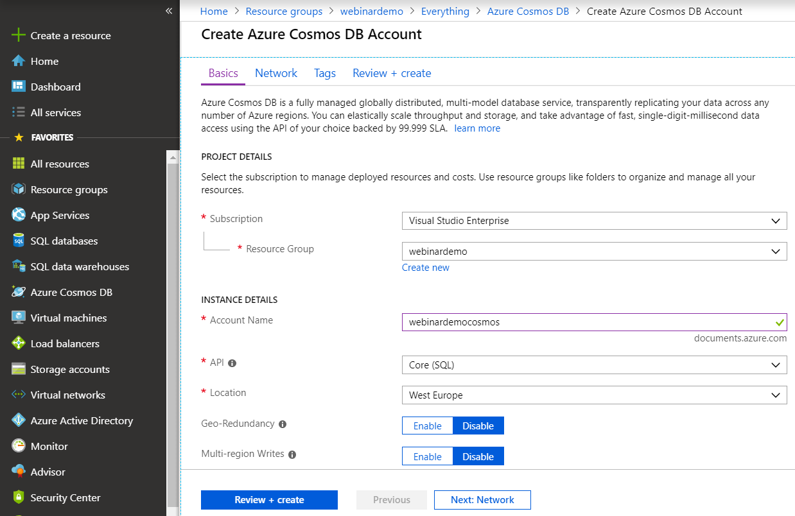
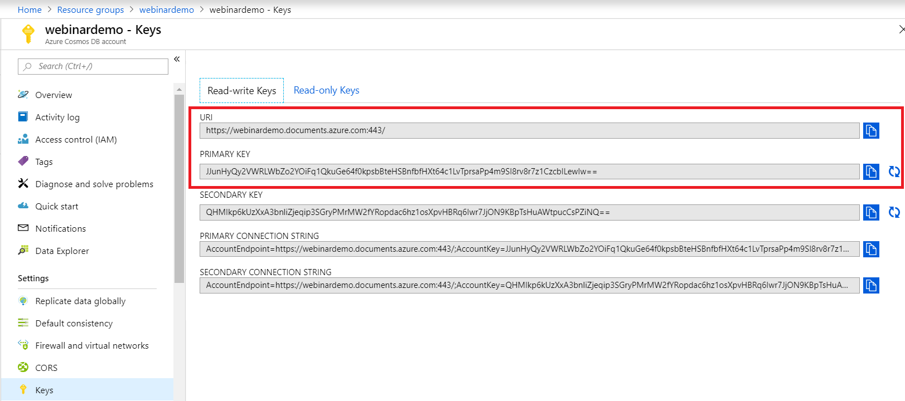

# CosmosDB

- Create a new Azure resource of the type **Azure Cosmos DB** with the following settings:

The account name must be unique.

- The connection parameters can be obtained here (highlighted in red):

