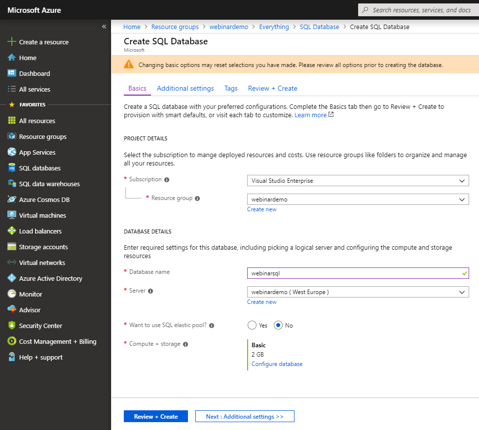

# SQL

- Create a new Azure resource of the type **SQL Database** with the following settings:

Enter a database name of your choosing and then select an existing SQL Server or click *Create New* to quickly configure a new server.

- The connection string can be obtained here:

