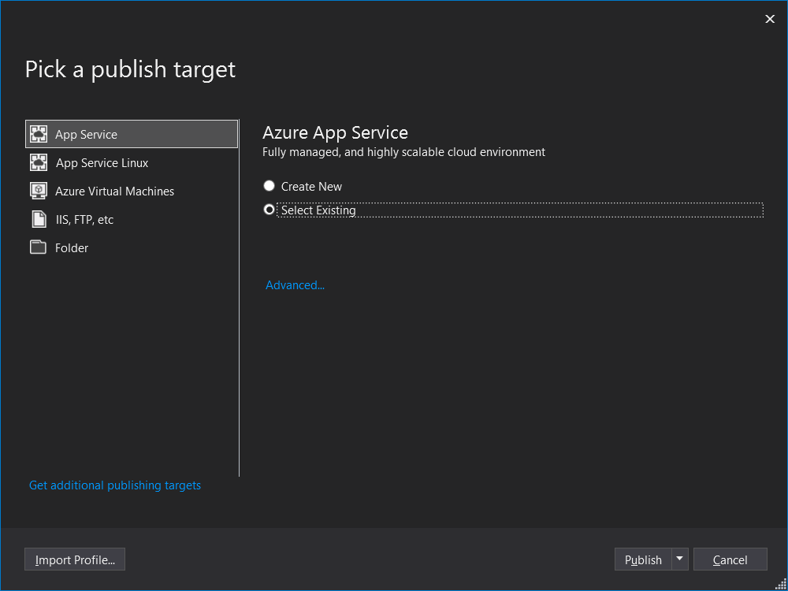

# Deploy the WebAPI

### Create resource

- Create a new Azure resource of the type **Web APP** with the following settings:

The app name must be unique.

### WebAPI Deployment

- On Visual Studio, under Solution Explorer, right click the project **Webinar.Data.WebAPI** and click **Publish**

- Select **App Service** and **Select Existing**

- Select the WebAPP created on the first step of this page

